# Active Directory Home Lab — Azure

## Overview
This project documents the deployment and configuration of a fully functional 
Active Directory environment on Microsoft Azure using Windows Server 2022.
It demonstrates real-world IT support and system administration skills including
user management, password resets, and organisational unit configuration.

## Tools Used
- Microsoft Azure (Free Tier)
- Windows Server 2022 Datacenter
- Active Directory Domain Services (AD DS)
- Remote Desktop Protocol (RDP)

## What I Built
- Created a resource group (AD-HomeLab) and deployed a Windows Server 2022 VM on Azure
- Connected to the server remotely via RDP
- Installed the Active Directory Domain Services role
- Promoted the server to a Domain Controller with a new forest (homelab.local)
- Created and managed three user accounts (Caleb Wallis, Sarah Johnson, Mike Peters)
- Performed a password reset on a user account
- Disabled and re-enabled a user account
- Created an Organisational Unit (IT Department) and moved a user into it

## Skills Demonstrated
- Microsoft Azure VM deployment and management
- Windows Server 2022 administration
- Active Directory configuration and management
- Remote server access via RDP
- User account creation and management
- Password resets and account unlocking
- Organisational Unit (OU) structure

---

## Screenshots

### 1. Azure Portal Dashboard
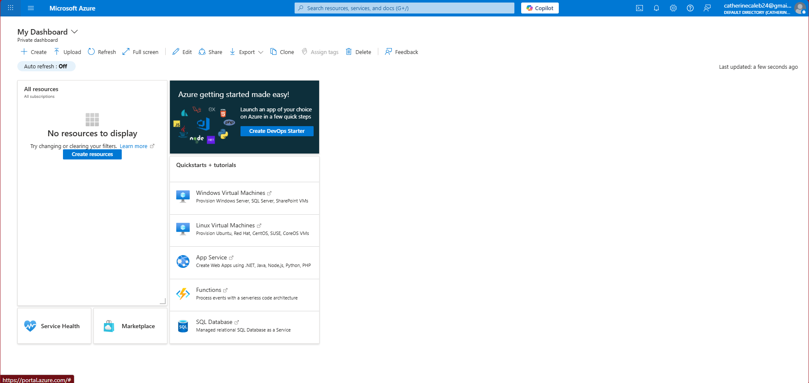

### 2. VM Creation — Project & Instance Details
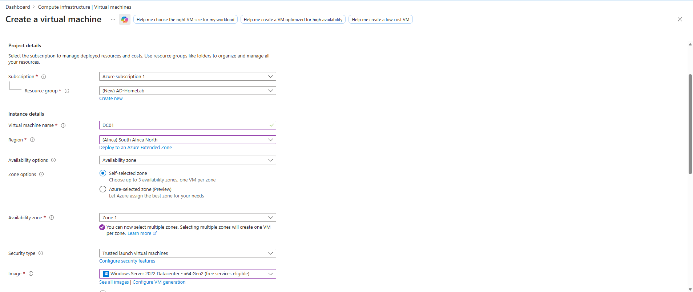

### 3. VM Creation — Size & Credentials
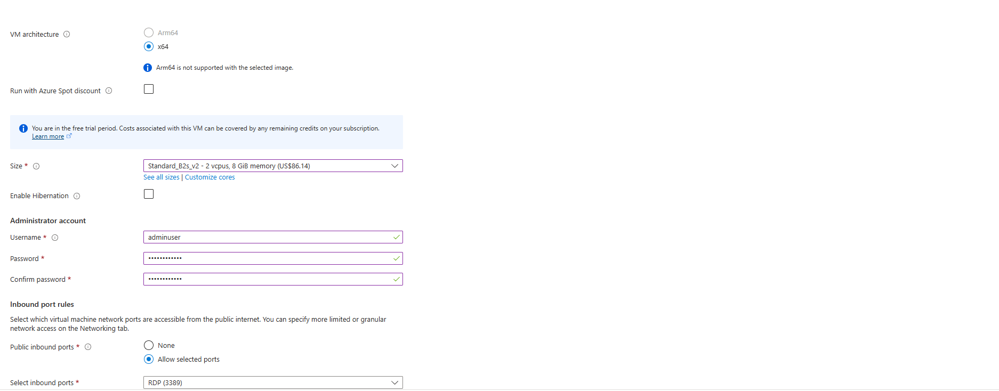

### 4. Deployment Complete
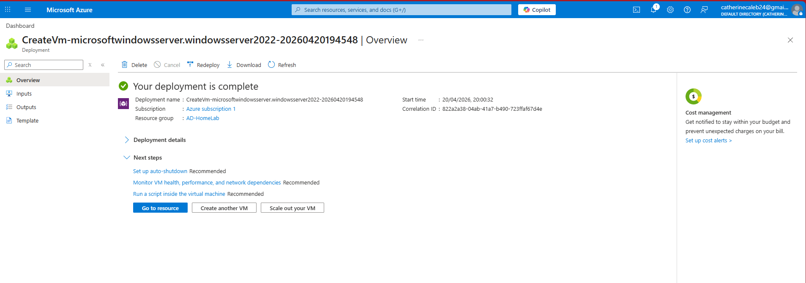

### 5. Connected to Server via RDP
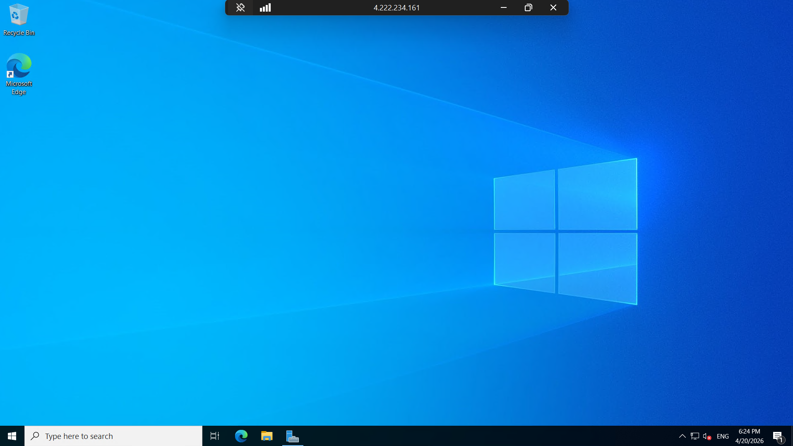

### 6. AD DS Installation Complete
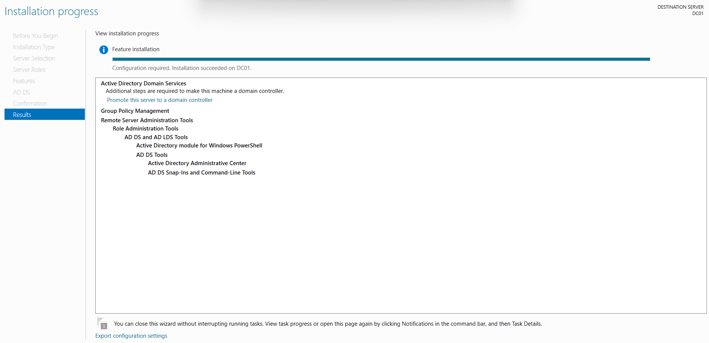

### 7. Domain Configuration — New Forest (homelab.local)
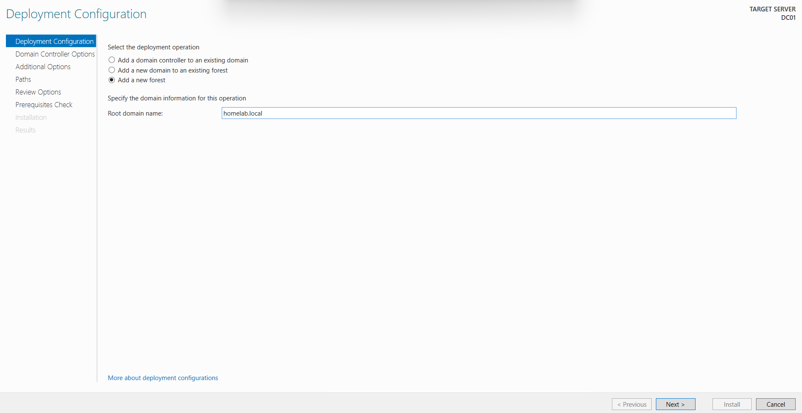

### 8. Server Manager — AD DS & DNS Roles Active
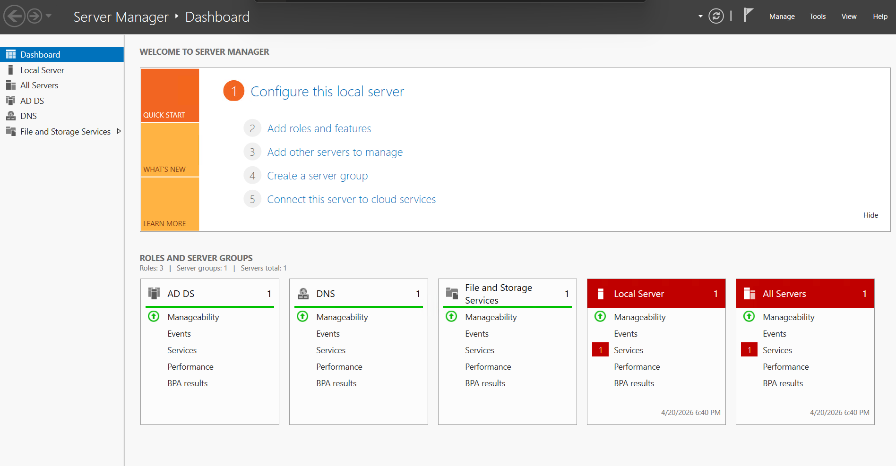

### 9. Password Reset — Caleb Wallis
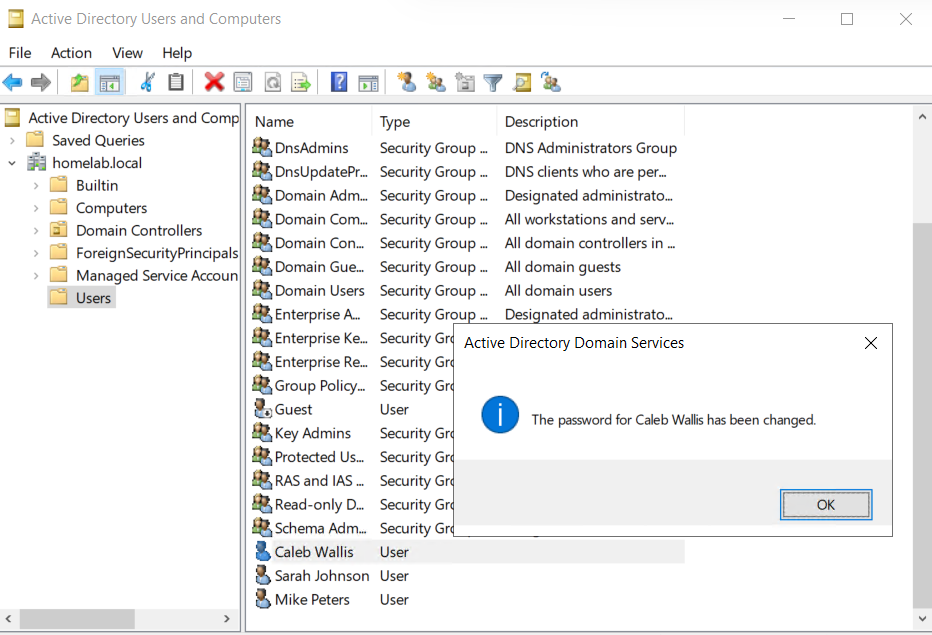

### 10. Users Created — Caleb Wallis, Sarah Johnson, Mike Peters
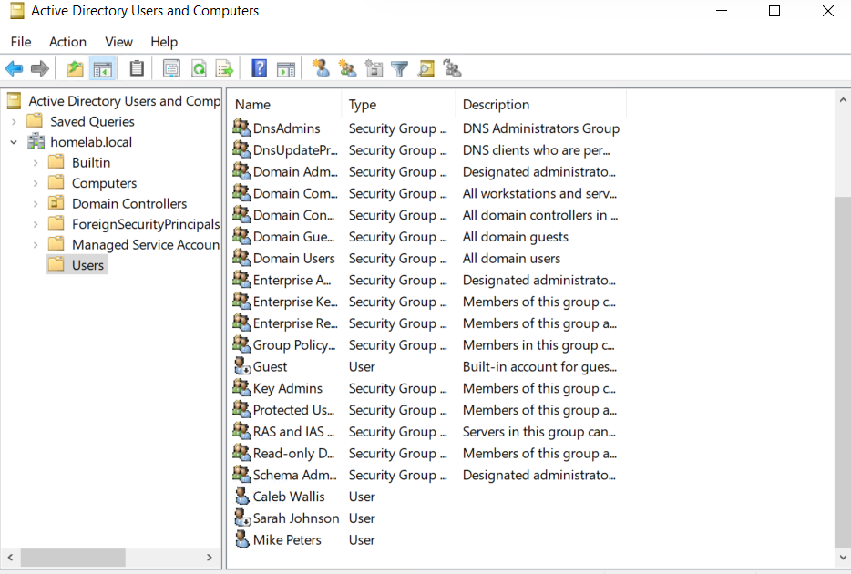

### 11. Account Re-enabled — Sarah Johnson
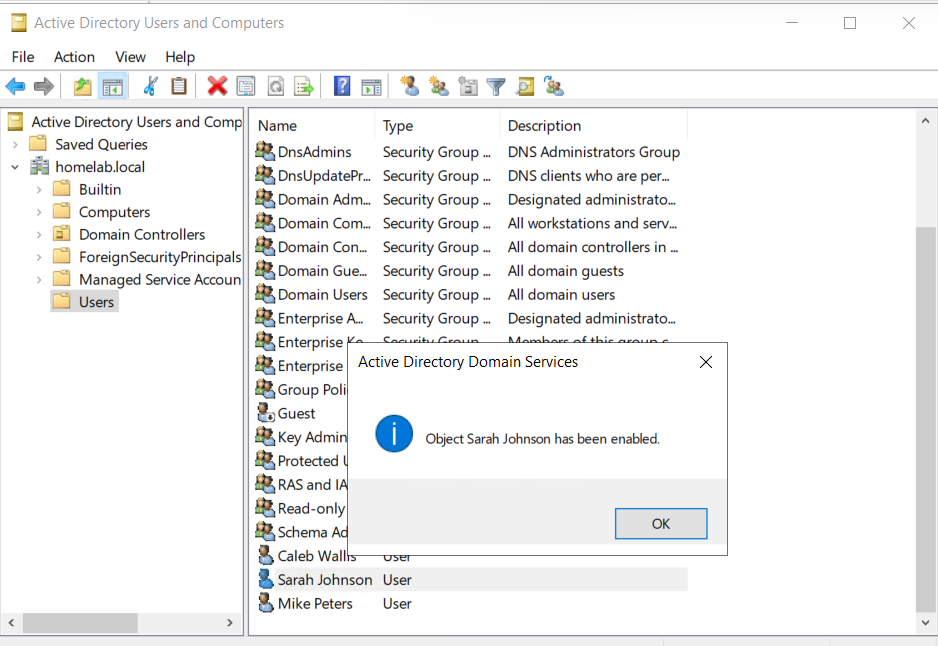

### 12. IT Department OU — User Moved In
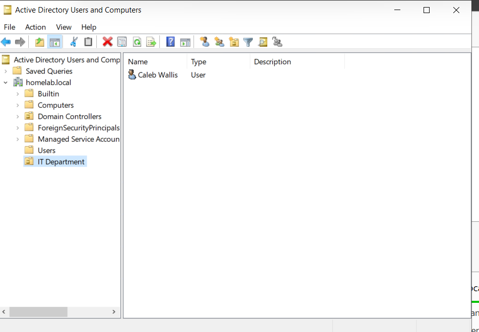
